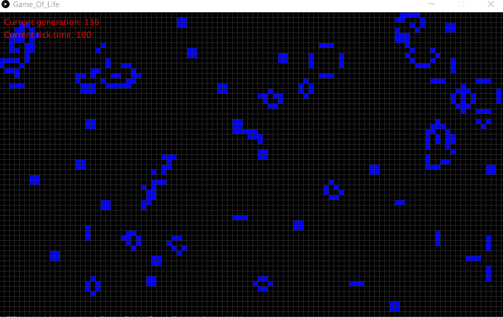

Basic gif of game of life project, does not show all the features in the game  
| --- |
in game controls  
P = pause  
C = clear screen  
R = restart  
+ = slow down the simulation (increase the tick time)  
- = speed up the simulation (decrease the tick time)  

while paused klicking on a square will let ju change it from dead to alive or alive to dead  
| --- |

